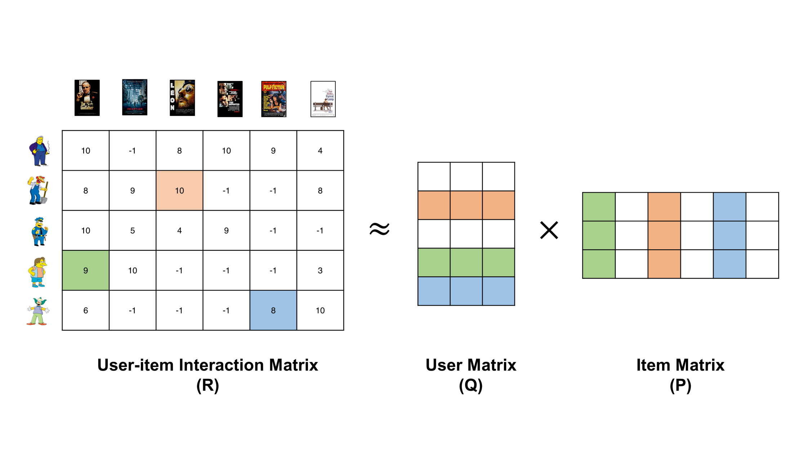
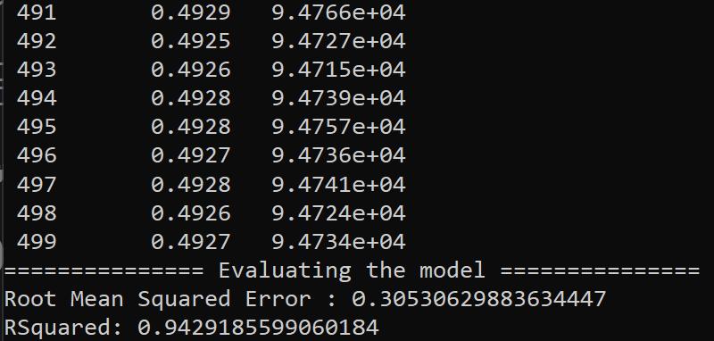

# MovieRS

API Ứng dụng xem phim hỗ trợ gợi ý sử dụng Recommendation System

<h2>1. Recommendation System</h2>

Tổng quan Hệ thống gợi ý

Hệ thống gợi ý, hay tiếng anh là Recommender System, là một hệ thống có khả năng tự động gợi ý cho người dùng những sản phẩm họ có thể thích. Đây là một giải pháp thay thế tốt nhất cho các thuật toán tìm kiếm, khi mà những sản phẩm họ có thể thích được tự động đề xuất kể cả khi người dùng có thực hiện hành động tìm tiếm hay không. Bằng cách sử dụng bộ dữ liệu thu thập được từ phía người dùng trước đó, hệ thống sẽ tiến hành dự đoán và đưa ra kết quả gợi ý cho người dùng về những sản phẩm, tính năng, hay dịch vụ... liên quan phù hợp với sở thích, độ quan tâm của người dùng. Từ đó giúp nâng cao được chất lượng dịch vụ cho ứng dụng cũng như thu lại được lợi nhuận cao, đặc biệt trong các sàn thương mại điện tử.

Recommemder System là một trong những mảng tương đối lớn của Học Máy Machine Learning và cũng có lịch sử khá lâu đời, khi lần đầu tiên hệ thống được đề cập trong một bài báo cáo kĩ thuật năm 1990 bởi Jussi Karlgren tại Đại Học Columbia và sau đó được triển khai quy mô lớn từ năm 1994 trở đi bởi Jussi Karlgren. Tuy nhiên, thực tế Recommendation Systems là chỉ thực sự bùng nổ khoảng 10-15 năm gần đây, khi việc tương tác trực tuyến của người dùng gia tăng, và sự phát triển mạnh mẽ của các sàn thương mại điện tử, và cũng không thể thiếu sự tiến bộ của ngành Khoa học dữ liệu hiện nay.

Các thuật ngữ sau đây sẽ thường được sử dụng,

- Đối tượng, hay người dùng mà hệ thống gợi ý hướng đến được gọi là users,
- Sản phẩm mà hệ thống đưa ra gợi ý được gọi là items
- Sự tương quan giữa các đối tượng và sản phẩm, mức độ quan tâm của đối tượng đối với sản phẩm đó được gọi là rating

Về phân loại, các Recommender Systems thường được chia thành hai nhóm lớn:

- Content-based systems: hoạt động dựa vào đặc điểm của items
- Collaborative filtering: hoạt động với sự cộng tác của users và rating.
  Trong đề tài này, nhóm chúng em tập trung phát triển hệ thống gợi ý, Recommender System theo hướng thứ hai: Collaborative filtering

### 1.1 Collaborative filtering

Lọc cộng tác, hay còn gọi là Collaborative filtering, là một nhóm phương pháp thuộc hệ thống gợi ý, Recommender System, hoạt động dựa trên sự tương quan giữa các users, items và rating, nhằm tìm ra sản phẩm mà người dùng có khả năng thích dựa vào những sản phẩm mà những người dùng khác có hành vi tương tự đã lựa chọn trước đó.
Ưu điểm của Collaborative filtering,

- Hệ thống tận dụng được những thông tin từ các users khác. Nếu biết được đặc điểm hành vi của một vài users tương tự nhau, hệ thống có thể suy luận ra hành vi của những users còn lại.
- Đơn giản, không cần phải mô tả đặc điểm mỗi item như Content-base
  Nhược điểm của Collaborative filtering,
- Hệ thống không giải quyết được các bài toán khởi đầu lạnh (cold-start problem) khi mà người dùng mới không có đặc điểm gì về hành vi, chưa đánh giá sản phẩm bất nào, hay các sản phẩm mới chưa được người dùng nào đánh giá...
- Khi ma trận đánh giá lớn, tức số lượng người dùng lẫn sản phẩm lớn thì thời gian tính toán sẽ tăng cao, khó đáp ứng tư vấn thời gian thực hoặc gần thời gian thực
  Ví dụ: Hai users A, và B đều thích cùng những items (tức là đều đánh giá điểm rating cho các items yêu thích ở mức từ 4 -> 5). Khi đó, dựa vào dữ liệu thu thập được trước đó của userA, ta thấy A thích một số items khác, như vậy nhiều khả năng, userB cũng sẽ thích những items này. Từ đó hệ thống sẽ đề xuất những items này cho userB.

|  |
| :---------------------------------------------: |
|      _Phương pháp Collaborative filtering_      |

|    |
| :-----------------------------------------------: |
| _Cách thức hoạt động của Collaborative filtering_ |

Việc xác định mức độ quan tâm của mỗi user tới một item dựa trên mức độ quan tâm của similar users tới item đó còn được gọi là User-user Collaborative Filtering.
Trên thực tế, User-user Collaboration filtering cũng tồn tại mặt hạn chế

- Số lượng users luôn lớn hơn số lượng items rất nhiều. Kéo theo việc tính toán rất lớn và phức tạp, và cũng gặp nhiều khó khăn trong việc lưu trữ ma trân dữ liệu.
- Khi một user thay đổi rating, hoặc rating thêm items, toàn bộ tính toán sẽ phải thực hiện lại
  Vì vậy mà, cũng có một hướng tiếp cận khác thay vì xác định user similarities, hệ thống sẽ xác định item similarities. Hướng này được gọi là Item-Item Collaborative Filtering, có thể giải quyết các mặt hạn chế của User-user, và cũng được sử dụng nhiều trong thực tế hơn.
  Trong đề tài này, nhóm chúng em phát triển hệ thống gợi ý, Collaborative filtering Recommender System theo hướng thứ nhất: User-user

### 1.2 Thuật toán Matrix Factorization

Phân tích ma trận thành nhân tử, hay còn gọi là Matrix Factorization, hoặc Matrix Decomposition là một thuật toán của phương pháp Collaborative Filtering Recommendation System.

|                                                             |
| :----------------------------------------------------------------------------------------: |
| _Hình minh họa thuật toán Matrix Factorization (với M,N lần lượt là số items và số users)_ |

Ý tưởng chính của Matrix Factorization áp dụng cho Recommendation Systems là giả định tồn tại các tính chất ẩn mô tả sự liên quan giữa các items và users. Tính chất ẩn có thể là đặc điểm mô tả của items, và cũng có thể là một sự kết hợp của những đặc điểm mô tả này hoặc cũng có thể là bất cứ điều gì mà ta không thực sự cần đặt tên. Mỗi item sẽ mang tính chất ẩn ở một mức độ nào đó tương ứng với các hệ số trong vector X của nó, hệ số càng cao tương ứng với việc mang tính chất đó càng cao. Tương tự, mỗi user cũng sẽ có xu hướng thích những tính chất ẩn nào đó và được mô tả bởi các hệ số trong vector W của nó.

$$
Y \approx
\begin{bmatrix}
  x_1w_1       & x_1w_2   & x_1w_3   & \cdots  & x_1w_N  \\
  x_2w_1       & x_2w_2   & x_2w_3   & \cdots  & x_2w_N  \\
  \vdots  & \vdots  & \vdots  & \ddots  & \vdots \\
  x_Mw_1       & x_Mw_1   & x_Mw_1   & \cdots  & x_Mw_N  \\
\end{bmatrix}
= \begin{bmatrix}
x_1 \\
  x_2\\
  \vdots\\
  x_M \\
\end{bmatrix}
\begin{bmatrix}
  w_1       & w_2   & w_3   & \cdots  & w_N  \\
\end{bmatrix}
= XW
$$

Sau khi tìm được các ma trận items X và ma trận users W, giá trị ước lượng rating của một user j lên một item i bằng biểu thức

$$
\^{y_{ij}} = x_i^Tw_y
$$

Giá trị kết quả của biểu thức sẽ cao nếu các thành phần tương ứng của X và W đều cao. Điều này nghĩa là item mang các tính chất ẩn mà user thích, vậy thì nên gợi ý item này cho user.
Xây dựng hàm mất mát
Việc xây dựng hàm mất mát cũng được dựa trên các thành phần đã được điền của Utility Matrix Y dựa trên biểu thức sau:

$$
\mathcal{L}(X,W) = \frac{1}{2s}\Sigma_{n=1}^N\Sigma_{m:r_{mn}}(y_{mn} - x_mw_n)^2+\frac{\lambda}{2}(\|X\|_F^2+\|W\|_F^2)
$$

Hàm mất mát của thuật toán Matrix Factoriazrtion

Trong đó $r_{mn}$ = 1 nếu item thứ m đã được đánh giá bởi user thứ n, $\|\bullet\|_F^2$ là căn bậc hai của tổng bình phương tất cả các phần tử của ma trận, s là toàn bộ số ratings đã có.
Việc tối ưu đồng thời X,W là tương đối phức tạp, thay vào đó, phương pháp được sử dụng là lần lượt tối ưu một ma trận trong khi cố định ma trận kia, tới khi hội tụ. Ví dụ:

Khi cố định X, việc tối ưu W đưa về việc tối ưu hàm:

$$
\mathcal{L}(W) = \frac{1}{2s}\Sigma_{n=1}^N\Sigma_{m:r_{mn}}(y_{mn} - x_mw_n)^2+\frac{\lambda}{2}\|W\|_F^2
$$

Hàm tối ưu W khi cố định X

Khi cố định W, việc tối ưu X đưa về viêc tối ưu hàm:

$$
\mathcal{L}(X) = \frac{1}{2s}\Sigma_{n=1}^N\Sigma_{m:r_{mn}}(y_{mn} - x_mw_n)^2+\frac{\lambda}{2}\|X\|_F^2
$$

Hàm tối ưu X khi cố định W

### 1.3 Microsoft ML

Microsoft ML (Machine Learning) là một bộ công cụ mạnh mẽ của Microsoft dùng để phát triển và triển khai các mô hình học máy. Nó cung cấp cho người dùng một loạt các tính năng và công cụ để tiến hành tiền xử lý dữ liệu, xây dựng mô hình, đánh giá và triển khai mô hình học máy.

Một trong những ứng dụng phổ biến của học máy là hệ thống đề xuất (recommendation systems), mục tiêu của nó là đề xuất cho người dùng một danh sách các mục dựa trên sở thích và hành vi của người dùng. Microsoft ML cung cấp sự hỗ trợ mạnh mẽ để xây dựng hệ thống đề xuất bằng cách sử dụng nhiều kỹ thuật khác nhau, bao gồm cả matrix factorization.

Microsoft ML cung cấp các thuật toán và công cụ đặc biệt được thiết kế cho hệ thống đề xuất dựa trên matrix factorization. Những công cụ này giúp đơn giản hóa việc triển khai và xây dựng các mô hình đề xuất, cho phép nhà phát triển tập trung vào thiết kế các chiến lược đề xuất hiệu quả và cung cấp trải nghiệm cá nhân hóa cho người dùng.

Với sự hỗ trợ của Microsoft ML, người phát triển có thể xây dựng các hệ thống đề xuất mạnh mẽ, phân tích hành vi người dùng, dự đoán chính xác và đề xuất các mục tiêu phù hợp trong nhiều lĩnh vực khác nhau như thương mại điện tử, dịch vụ streaming nội dung và quảng cáo cá nhân hóa.

### 1.4 Dataset

Ở đây sử dụng dataset của Movielens với mẫu dữ liệu 100K https://grouplens.org/datasets/movielens/latest/

### 1.5 Tạo và đánh giá Model

1. Chọn các Feature: Ở đây thì dataset có nhiều thông tin như userId, movieId, timestamp... Nhưng khi đánh giá thì việc sử dụng dấu thời gian không ảnh hưởng đến đánh giá model nên có thể bỏ qua.
2. Model training: Ở đây dùng Trainers.MatrixFactorizationTrainer có các hyper params như NumberOfIterations, ApproximationRank. Sau khi thay đổi các siêu tham số này thì thấy việc chọn (500, 128) ra kết quả tương đối tốt so với thời gian và công sức bỏ ra. Model artifact được xây dựng ở mức tốt nhất theo đánh giá hồi quy (Regression evaluation) là:

|                                                                                                                                                                                                         |
| :-------------------------------------------------------------------------------------------------------------------------------------------------------------------------------------------------------------------------------: |
|                                                                                            _Đánh giá model bằng Regression evaluation_                                                                                            |
| _Sai số trung bình bình phương (RMSE) là một chỉ số đánh giá đo lường sự khác biệt trung bình giữa các giá trị dự đoán và giá trị thực tế. Giá trị RMSE càng thấp, chứng tỏ mô hình gợi ý có độ chính xác và độ tin cậy cao hơn._ |

Như kết quả cho thấy thì RMSE của mô hình là 0.30322599746270273 và RSquared là 0.9436937947430915, cho thấy mô hình gợi ý dựa trên phân rã ma trận đã hoạt động tốt, với mức độ sai số thấp và khả năng giải thích phương sai cao đối với biến mục tiêu.

<h2>2. API</h2>

Ứng dụng được xây dựng với các nhóm và chức năng như sau

- Swagger API: https://movie-rs.azurewebsites.net/swagger/index.html
- Tài khoản thử:
  - email: test_account@gmail.com
  - password: test_account

| STT | Tên         | Danh sách endpoint                                                                                                                                                                                                                     | Method                                                                                                                                         | Mô tả                                                                                                                                                                                                                                                                                                                                                                                                    |
| --- | ----------- | -------------------------------------------------------------------------------------------------------------------------------------------------------------------------------------------------------------------------------------- | ---------------------------------------------------------------------------------------------------------------------------------------------- | -------------------------------------------------------------------------------------------------------------------------------------------------------------------------------------------------------------------------------------------------------------------------------------------------------------------------------------------------------------------------------------------------------- |
| 1   | /Auth       | <ul><li>/login</li><li>/register</li><li>/verify-account</li><li>/lost-account</li><li>/reset-account</li></ul>                                                                                                                        | <ul><li>POST</li><li>POST</li><li>POST</li><li>POST</li><li>POST</li></ul>                                                                     | <ul><li>Đăng nhập</li><li>Đăng ký</li><li>Xác nhận tạo tài khoản</li><li>Báo quên mật khẩu</li><li>Khôi phục mật khẩu</li></ul>                                                                                                                                                                                                                                                                          |
| 2   | /Collection | <ul><li>/{id}</li></ul>                                                                                                                                                                                                                | <ul><li>GET</li></ul>                                                                                                                          | <ul><li>Lấy thông tin về series phim</li></ul>                                                                                                                                                                                                                                                                                                                                                           |
| 3   | /Country    | <ul><li>/</li></ul>                                                                                                                                                                                                                    | <ul><li>GET</li></ul>                                                                                                                          | <ul><li>Danh sách các nước trên thế giới</li></ul>                                                                                                                                                                                                                                                                                                                                                       |
| 4   | /Favourite  | <ul><li>/</li><li>/</li><li>/{id}</li></ul>                                                                                                                                                                                            | <ul><li>GET</li><li>POST</li><li>DELETE</li></ul>                                                                                              | <ul><li>Danh sách các phim đã yêu thích</li><li>Thêm mới yêu thích</li><li>Bỏ yêu thích phim</li></ul>                                                                                                                                                                                                                                                                                                   |
| 5   | /History    | <ul><li>/</li><li>/</li><li>/</li><li>/{id}</li></ul>                                                                                                                                                                                  | <ul><li>GET</li><li>POST</li><li>DELETE</li><li>DELETE</li></ul>                                                                               | <ul><li>Danh sách lịch sử xem phim</li><li>Thêm lịch sử xem phim</li><li>Dọn dẹp lịch sử xem phim</li><li>Bỏ 1 phim ra khỏi lịch sử đã xem</li></ul>                                                                                                                                                                                                                                                     |
| 6   | /Image      | <ul><li>/{path}</li></ul>                                                                                                                                                                                                              | <ul><li>GET</li></ul>                                                                                                                          | <ul><li>Lấy hình ảnh của phim thumbnail/poster</li></ul>                                                                                                                                                                                                                                                                                                                                                 |
| 7   | /Movie      | <ul><li>/video-api</li><li>/{id}</li><li>/{id}/videos</li><li>/{id}/actors</li><li>/{id}/images</li><li>/{id}/recommendation</li><li>/{id}/review</li><li>/popular</li><li>/now_playing</li><li>/upcoming</li><li>/top_rated</li></ul> | <ul><li>POST</li><li>GET</li><li>GET</li><li>GET</li><li>GET</li><li>GET</li><li>GET</li><li>GET</li><li>GET</li><li>GET</li><li>GET</li></ul> | <ul><li>Cập nhật server cung cấp video</li><li>Thông tin chi tiết phim</li><li>Danh sách link phim</li><li>Danh sách diễn viên đóng</li><li>Danh sách thumbnail/poster</li><li>Gợi ý phim liên quan đến phim</li><li>Danh sách đánh giá phim</li><li>Danh sách phim phổ biến</li><li>Danh sách phim đang công chiếu</li><li>Danh sách phim sắp ra mắt</li><li>Dánh sách top phim điểm IMDB cao</li></ul> |
| 8   | /Person     | <ul><li>/{id}</li><li>/{id}/movies</li></ul>                                                                                                                                                                                           | <ul><li>GET</li><li>GET</li></ul>                                                                                                              | <ul><li>Thông tin diễn viên</li><li>Danh sách phim mà diễn viên đóng</li></ul>                                                                                                                                                                                                                                                                                                                           |
| 9   | /Review     | <ul><li>/</li><li>/</li><li>/</li><li>/{id}</li><li>/{id}</li></ul>                                                                                                                                                                    | <ul><li>GET</li><li>POST</li><li>PUT</li><li>GET</li><li>DELETE</li></ul>                                                                      | <ul><li>Danh sách những đánh giá</li><li>Thêm đánh giá</li><li>Cập nhập đánh giá</li><li>Chi tiết đánh giá phim</li><li>Xóa đánh giá</li></ul>                                                                                                                                                                                                                                                           |
| 10  | /Search     | <ul><li>/movie/{query}</li><li>/person/{query}</li></ul>                                                                                                                                                                               | <ul><li>GET</li><li>GET</li></ul>                                                                                                              | <ul><li>Tìm kiếm phim</li><li>Tìm kiếm diễn viên</li></ul>                                                                                                                                                                                                                                                                                                                                               |
| 11  | /User       | <ul><li>/</li><li>/change-password</li><li>/recommendation</li></ul>                                                                                                                                                                   | <ul><li>GET</li><li>PUT</li><li>GET</li></ul>                                                                                                  | <ul><li>Lấy thông tin của tài khoản hiện tại</li><li>Thay đổi mật khẩu</li><li>Danh sách phim gợi ý dựa vào lịch sử</li></ul>                                                                                                                                                                                                                                                                            |

